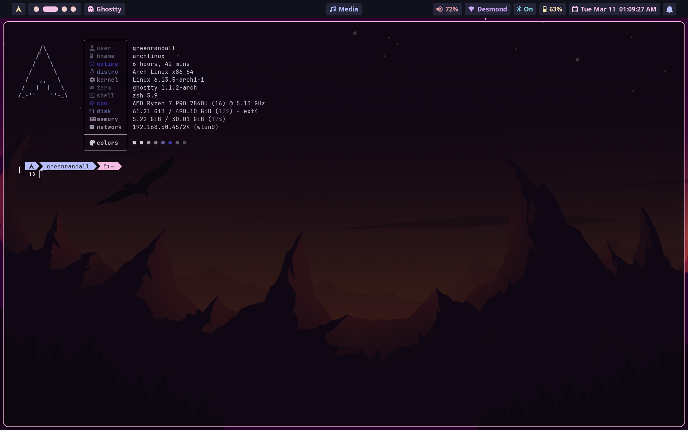

# dotfiles

## Zsh layout

This repo uses a modular zsh setup instead of one large `.zshrc`.

### Files

- `zshrc/dot-zshrc` — loader only
- `zshrc/.config/zshrc/00-init` — env, PATH, bootstrap
- `zshrc/.config/zshrc/20-customisation` — plugins, history, fzf, prompt
- `zshrc/.config/zshrc/25-aliases` — aliases
- `zshrc/.config/zshrc/30-autostart` — interactive shell startup behavior

### How it works

On a machine, `~/.zshrc` should stay small and just load the numbered modules from `~/.config/zshrc/`.

If a matching file exists in `~/.config/zshrc/custom/`, that file overrides the shared module for that machine.

Use that pattern for machine-specific changes instead of hardcoding everything into the shared config.

### Pi skill

A repo-local Pi skill lives at:

- `.pi/skills/modular-zshrc/SKILL.md`

Use it when updating or syncing the modular zsh setup.

## Styled Shell Prompt
Built with [ohmyposh](https://ohmyposh.dev/)

[My theme](ohmyposh/.config/ohmyposh/randalls-posh-prompt.json)

